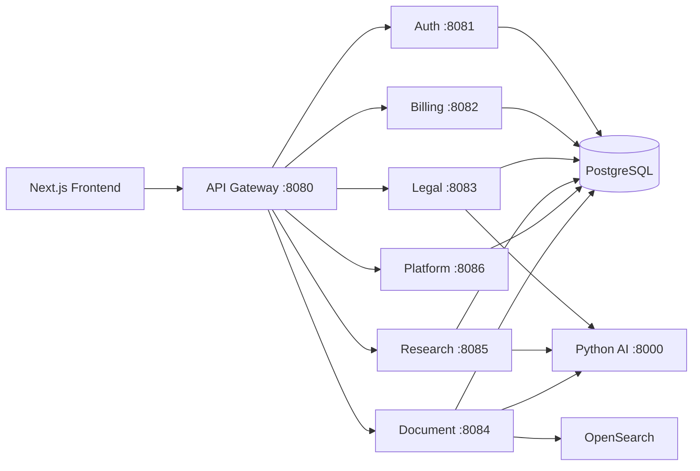

# LawAI Spring Boot Microservices

Monolitik `springboot-backend` uygulaması, bağımsız deploy edilebilir microservislere ayrıldı. Frontend ve Python AI backend aynı API sözleşmesiyle **API Gateway** (`8080`) üzerinden konuşur.

## Mimari



| Servis | Port | Sorumluluk |
|--------|------|------------|
| **api-gateway** | 8080 | Tek giriş noktası, CORS, route |
| **auth-service** | 8081 | Kayıt, oturum, Google OAuth, e-posta |
| **billing-service** | 8082 | Abonelik planları, Stripe |
| **legal-service** | 8083 | Chat, içtihat, dilekçe, dava, doküman analizi |
| **document-service** | 8084 | PDF yükleme, pgvector + OpenSearch arama |
| **research-service** | 8085 | Çok kaynaklı hukuki araştırma (SSE) |
| **platform-service** | 8086 | Aktivite logları, geri bildirim |

## Modüller

```
springboot-backend/
├── pom.xml                 # Parent POM (microservices)
├── lawai-common/           # Ortak güvenlik, HTTP istemcileri
├── auth-service/
├── billing-service/
├── legal-service/
├── document-service/
├── research-service/
├── platform-service/
├── api-gateway/
├── monolith/               # Eski tek-parça uygulama (legacy, opsiyonel)
├── start-microservices.bat # Önerilen başlatma
└── start-monolith.bat      # Sadece geri dönüş için
```

## Eski kod vs yeni kod

| | **Microservices (yeni)** | **Monolith (eski)** |
|---|---|---|
| Konum | `auth-service/`, `legal-service/`, … | `monolith/src/` |
| Varsayılan build | Evet (`mvn install`) | Hayır (profil gerekir) |
| Port | Gateway `8080` | Tek process `8080` |
| Birlikte çalışır mı? | **Hayır** — ikisi de 8080 kullanır |

Eski kod silinmedi; `monolith/` altına taşındı. Yeni geliştirmeler ilgili microservice modülünde yapılmalı. Monolit yalnızca geçiş veya karşılaştırma için kullanılır:

```bash
./mvnw -pl monolith -Plegacy-monolith spring-boot:run
# veya
start-monolith.bat
```

## Gereksinimler

- Java 24
- PostgreSQL + pgvector (`docker-compose up postgres`)
- OpenSearch (`docker-compose up opensearch`) — document/research için
- Python AI backend (`localhost:8000`)

## Yerel çalıştırma

```bash
# Altyapı
docker-compose up -d postgres opensearch

# Tüm servisleri derle
cd springboot-backend
./mvnw install -DskipTests

# Windows: tek komutla başlat
start-microservices.bat

# veya servisleri ayrı ayrı
./mvnw -pl auth-service spring-boot:run
./mvnw -pl api-gateway spring-boot:run
# ...
```

Frontend `http://localhost:8080` adresine istek atmalı (gateway).

## Servisler arası iletişim

- **Oturum doğrulama:** Diğer servisler `auth-service` `/internal/session/validate` endpoint'ini çağırır (`lawai-common` → `AuthSessionClient`).
- **Aktivite logu:** Servisler `platform-service` `/internal/activity-logs` endpoint'ine HTTP POST yapar (`ActivityLogClient`).

## Docker (opsiyonel)

Her modül için JAR build sonrası:

```bash
./mvnw -pl auth-service package -DskipTests
docker build --build-arg JAR_FILE=auth-service/target/auth-service-*.jar -t lawai-auth .
```

`docker-compose.yml` içinde microservice blokları eklenebilir; şu an postgres ve opensearch aktiftir.

## Notlar

- Tüm servisler varsayılan olarak aynı PostgreSQL veritabanını (`lawai`) kullanır; tablolar domain bazında ayrılmıştır.
- Eski monolit kodu `src/` altında durur; yeni geliştirmeler ilgili microservice modülünde yapılmalıdır.
- Gateway route tanımları: `api-gateway/src/main/resources/application.yml`
