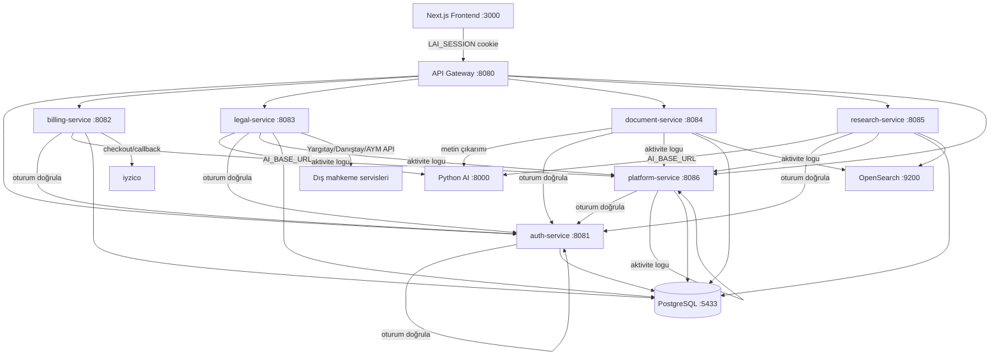
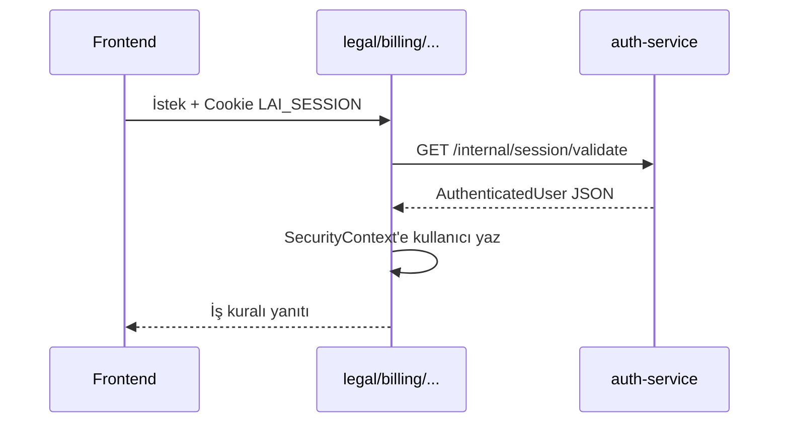
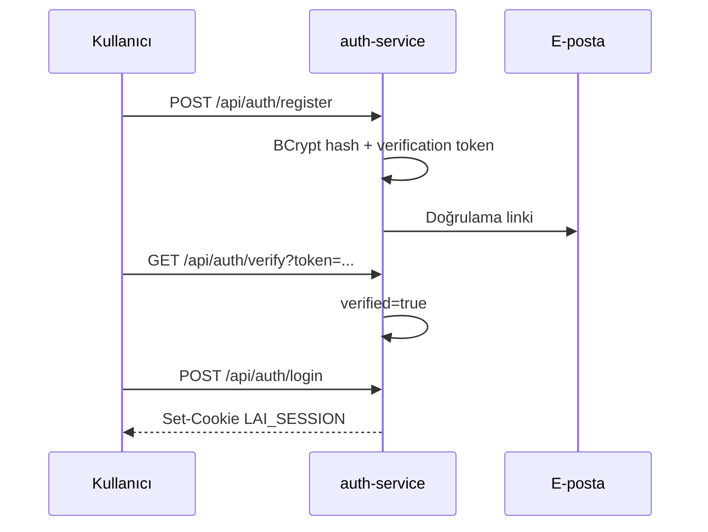
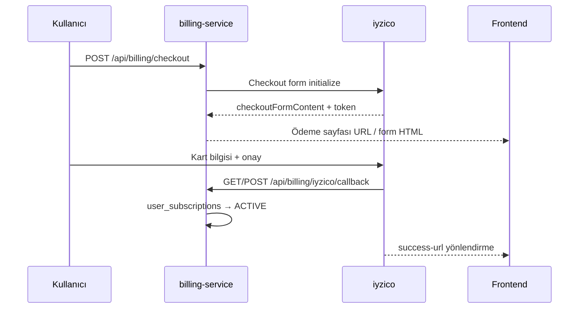
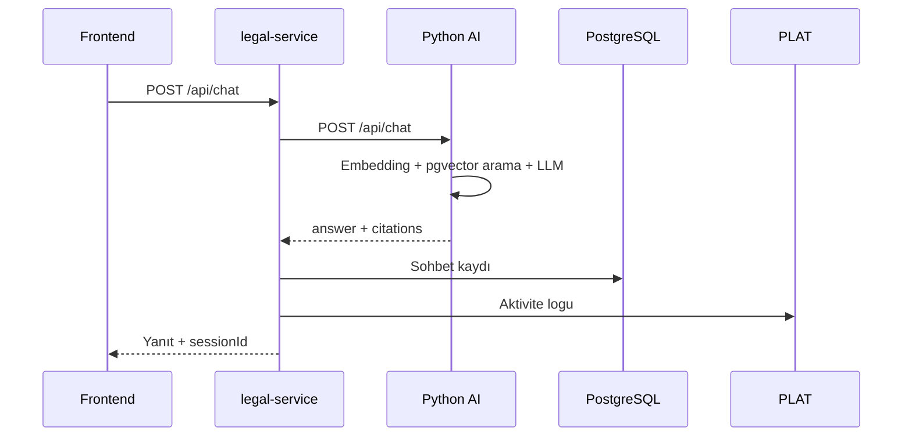
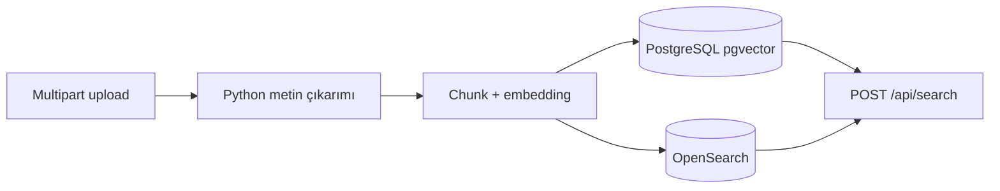
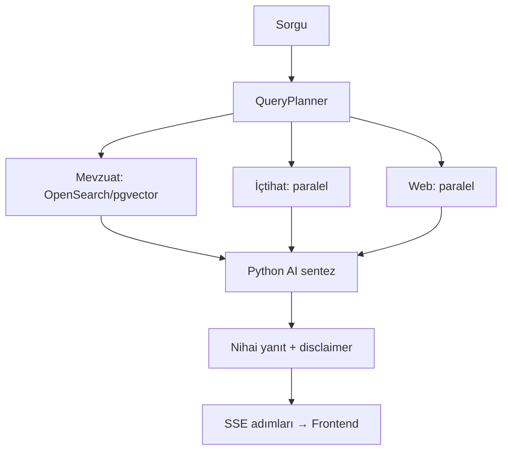

# LawAI Spring Boot Microservices

Spring Boot uygulaması bağımsız deploy edilebilir microservislere ayrıldı. Frontend ve Python AI backend aynı API sözleşmesiyle **API Gateway** (`8080`) üzerinden konuşur.

Bu doküman her servisin **ne yaptığını**, **hangi veriyi tuttuğunu**, **kiminle nasıl konuştuğunu** ve **tipik iş akışlarını** açıklar.

---

## Mimari



### Servis özeti

| Servis | Port | Temel sorumluluk |
|--------|------|------------------|
| **api-gateway** | 8080 | Tek giriş noktası, CORS, path bazlı yönlendirme |
| **auth-service** | 8081 | Kimlik, oturum, e-posta, Google OAuth, kullanıcı yönetimi |
| **billing-service** | 8082 | Abonelik planları, kullanıcı abonelikleri, iyzico ödeme |
| **legal-service** | 8083 | Sohbet, içtihat, dilekçe, dava dosyası, kullanıcı belge analizi |
| **document-service** | 8084 | Kurumsal belge yükleme, pgvector + OpenSearch arama, toplu iş |
| **research-service** | 8085 | Çok kaynaklı hukuki araştırma (SSE ile canlı ilerleme) |
| **platform-service** | 8086 | Aktivite logları, kullanıcı geri bildirimleri |

### Gateway route tablosu

Tüm route tanımları: `api-gateway/src/main/resources/application.yml`

| Path öneki | Hedef servis |
|------------|--------------|
| `/api/auth/**`, `/internal/session/**` | auth-service |
| `/api/subscriptions/**`, `/api/billing/**` | billing-service |
| `/api/chat/**`, `/api/precedents/**`, `/api/petitions/**`, `/api/documents/**`, `/api/knowledge/**` | legal-service |
| `/api/cases/**` | legal-service |
| `/api/health` | legal-service |
| `/api/upload`, `/api/search`, `/api/batch-documents/**` | document-service |
| `/api/research/**` | research-service |
| `/api/activity-logs/**`, `/api/feedback/**` | platform-service |

---

## Ortak modül: `lawai-common`

Tüm domain servisleri (gateway hariç) bu modülü paylaşır.

**Ne sağlar:**

| Bileşen | Açıklama |
|---------|----------|
| `RemoteSessionAuthenticationFilter` | `LAI_SESSION` çerezini okur, `auth-service`'e doğrulatır |
| `AuthSessionClient` | `GET /internal/session/validate` HTTP çağrısı |
| `ActivityLogClient` | `POST /internal/activity-logs` ile platform-service'e log yazar |
| `AuthenticatedUser` | `id`, `name`, `email`, `role` (USER / ADMIN) |
| `MicroserviceSecurityConfig` | Servis bazlı SecurityFilterChain şablonu |
| `HealthController` | `GET /health` (servis içi sağlık) |

**Oturum akışı (tüm korumalı endpoint'ler):**



---

## api-gateway (`:8080`)

**Ne yapar:** Frontend'in gördüğü tek API yüzü. İş mantığı çalıştırmaz; istekleri path'e göre ilgili microservice'e proxy eder.

**Sorumluluklar:**
- CORS: `localhost:3000` / `3001` origin'lerine `allowCredentials: true`
- Çoklu servisten gelen CORS başlıklarını birleştirme (`DedupeResponseHeader`)
- Ortam değişkeni ile servis URL override (`AUTH_SERVICE_URL`, `LEGAL_SERVICE_URL`, vb.)

**Ne yapmaz:** Veritabanına bağlanmaz, oturum oluşturmaz, AI çağırmaz.

---

## auth-service (`:8081`)

**Ne yapar:** Tüm kullanıcı kimliği ve oturum yaşam döngüsünü yönetir. Diğer servislerin güvenlik modelinin merkezidir.

### Sorumluluklar

| Alan | Detay |
|------|-------|
| **Kayıt** | E-posta + şifre; doğrulama token'ı üretir, SMTP ile link gönderir |
| **Giriş / çıkış** | BCrypt şifre doğrulama; `LAI_SESSION` HttpOnly çerezi |
| **Google OAuth** | ID token doğrulama; mevcut veya yeni kullanıcı oluşturma |
| **Oturum doğrulama** | `/internal/session/validate` — diğer servisler için |
| **Şifre yönetimi** | Unuttum / sıfırla / değiştir akışları |
| **Kullanıcı CRUD** | ADMIN rolü ile liste, oluştur, güncelle, sil |
| **Bootstrap** | İlk açılışta varsayılan admin hesabı (`admin@lawai.local`) |

### Veri tabloları

- `users` — ad, e-posta, şifre hash, rol, doğrulama durumu
- `auth_sessions` — oturum token'ı, son kullanım, remember-me süresi
- `email_verifications` — kayıt doğrulama token'ları
- `password_resets` — şifre sıfırlama token'ları

### Endpoint'ler

| Method | Path | Açıklama |
|--------|------|----------|
| POST | `/api/auth/register` | Yeni kullanıcı kaydı |
| GET | `/api/auth/verify` | E-posta doğrulama |
| POST | `/api/auth/login` | Oturum aç |
| POST | `/api/auth/google` | Google ile giriş |
| POST | `/api/auth/logout` | Oturum kapat |
| GET | `/api/auth/me` | Oturumdaki kullanıcı |
| PUT | `/api/auth/me` | Profil güncelle |
| POST | `/api/auth/password/forgot` | Sıfırlama e-postası |
| POST | `/api/auth/password/reset` | Token ile yeni şifre |
| POST | `/api/auth/password/change` | Mevcut şifre ile değiştir |
| GET/POST/PUT/DELETE | `/api/auth/users/**` | ADMIN kullanıcı yönetimi |
| GET | `/internal/session/validate` | Servisler arası oturum doğrulama |

### Kayıt akışı



### Yapılandırma (`application.yml`)

- `app.auth.google-client-id` — Google OAuth
- `app.auth.bootstrap-*` — İlk admin hesabı
- `spring.mail.*` — SMTP (`.env.smtp` veya ortam değişkenleri)
- `app.auth.cookie-secure` — Üretimde `true` önerilir

---

## billing-service (`:8082`)

**Ne yapar:** Abonelik planlarını, kullanıcı abonelik durumlarını ve iyzico ödeme entegrasyonunu yönetir.

### Sorumluluklar

| Alan | Detay |
|------|-------|
| **Plan kataloğu** | Aylık/yıllık fiyat, özellik listesi, iyzico ürün referansları |
| **Kullanıcı aboneliği** | `PENDING_PAYMENT`, `ACTIVE`, `PAUSED`, `PAST_DUE`, `CANCELLED`, `EXPIRED` |
| **iyzico checkout** | Abonelik ödeme formu oluşturma |
| **Callback / webhook** | Ödeme sonrası abonelik durumu güncelleme |
| **Ücretsiz plan** | Fiyat 0 ise doğrudan `ACTIVE` aktivasyon |
| **Katalog senkronu** | `IyzicoCatalogService` ile planları iyzico'ya eşleme |
| **Yaşam döngüsü** | Saatlik scheduler ile süresi dolan abonelikleri `EXPIRED` yapma |

### Veri tabloları

- `subscription_plans` — plan tanımları, iyzico ref'leri, özellikler
- `user_subscriptions` — kullanıcı-plan eşlemesi, provider ID'leri, dönem tarihleri
- `billing_events` — ödeme ve webhook olay kayıtları

### Endpoint'ler

| Method | Path | Açıklama |
|--------|------|----------|
| GET | `/api/subscriptions` | Aktif plan listesi (herkese açık) |
| GET | `/api/subscriptions/me` | Oturumdaki kullanıcının aboneliği |
| POST | `/api/subscriptions/me` | Plan seçimi (ödeme öncesi kayıt) |
| POST | `/api/subscriptions/me/cancel` | Abonelik iptali |
| POST | `/api/billing/checkout` | iyzico ödeme oturumu başlat |
| GET/POST | `/api/billing/iyzico/callback` | Ödeme dönüş URL'si |
| POST | `/api/billing/iyzico/webhook` | iyzico webhook |
| GET/POST/PUT/DELETE | `/api/subscriptions/admin/**` | ADMIN plan ve kullanıcı abonelik yönetimi |

### Ödeme akışı



### Yapılandırma

- `app.billing.iyzico.*` — API key, secret, merchant ID, sandbox/production URL
- `IYZICO_AUTO_SYNC` — Planları iyzico kataloğuna otomatik senkron
- `BILLING_SUCCESS_URL` / `BILLING_CANCEL_URL` — Ödeme sonrası frontend yönlendirmesi

---

## legal-service (`:8083`)

**Ne yapar:** Ürünün çekirdek hukuk işlevlerini sunar — AI destekli sohbet, mahkeme kararı arama, dilekçe üretimi, dava dosyası takibi ve kullanıcı belgelerinin bilgi bankasına eklenmesi.

Python AI servisine en çok bağımlı olan Spring servisidir.

### Sorumluluklar

#### Sohbet (Chat)

- Kullanıcı sorusunu Python `/api/chat` endpoint'ine iletir
- Dönen yanıt + içtihat atıflarını PostgreSQL'de `chat_sessions` / `chat_messages` tablolarına kaydeder
- Oturum listeleme, detay ve silme API'leri sunar

#### İçtihat arama

- **Yargıtay:** `karararama.yargitay.gov.tr` REST API entegrasyonu
- **Danıştay:** `karararama.danistay.gov.tr` entegrasyonu
- **Anayasa Mahkemesi (AYM):** Karar detay çekme
- Gelişmiş filtreler: tarih aralığı, daire, esas/karar numarası
- Karar özeti ve dilekçeye uygulama Python AI üzerinden

#### Dilekçe

- Olay özeti, talepler ve dava bağlamından Python `/api/petitions` ile taslak üretir

#### Belge işleme (kullanıcı yüzü)

`document-service`'ten farklı olarak bu uçlar **RAG bilgi bankası** (`knowledge_documents` / Python pgvector) içindir:

| Endpoint | Amaç |
|----------|------|
| `POST /api/documents/analyze` | Ön kontrol: format, boyut, metin çıkarılabilirlik |
| `POST /api/documents/ingest` | Metin çıkar → parçala → Python'a indeksleme |
| `POST /api/knowledge/documents` | Ham metin parçalarını indeksleme |
| `POST /api/knowledge/seed-precedents` | Örnek emsal verilerini yükleme |

Metin çıkarımı: önce yerel PDFBox/POI; gerekirse Python `/api/documents/extract-text`.

#### Dava dosyası yönetimi

- Dava türü şablonları (boşanma, icra, iş hukuku vb.)
- Her şablonda zorunlu/opsiyonel belge kontrol listesi
- Belge tamamlanma durumu ve ilerleme yüzdesi
- Örnek dava kayıtları seed'i

### Veri tabloları

- `chat_sessions`, `chat_messages` — sohbet geçmişi
- `legal_cases`, `case_documents` — dava kayıtları ve belge checklist'i

### Endpoint'ler

| Method | Path | Açıklama |
|--------|------|----------|
| POST | `/api/chat` | AI sohbet |
| GET/DELETE | `/api/chat/sessions/**` | Sohbet geçmişi |
| POST | `/api/precedents/yargitay/search` | Çok mahkeme içtihat araması |
| GET | `/api/precedents/yargitay/{id}` | Yargıtay karar detayı |
| GET | `/api/precedents/danistay/{id}` | Danıştay karar detayı |
| GET | `/api/precedents/aym/{year}/{number}` | AYM karar detayı |
| POST | `/api/precedents/summarize` | AI karar özeti |
| POST | `/api/precedents/apply-to-petition` | Emsali dilekçeye uygula |
| POST | `/api/petitions` | Dilekçe taslağı |
| POST | `/api/documents/analyze` | Belge ön kontrol |
| POST | `/api/documents/ingest` | Bilgi bankasına indeksle |
| POST | `/api/knowledge/**` | Bilgi bankası yönetimi |
| GET/POST/PATCH/DELETE | `/api/cases/**` | Dava dosyası CRUD |
| GET | `/api/health` | Gateway üzerinden sağlık kontrolü |

### Sohbet (RAG) akışı



### Dış bağımlılıklar

- Python AI (`AI_BASE_URL`)
- Yargıtay / Danıştay / AYM karar arama siteleri (canlı HTTP)
- platform-service (aktivite logu)

### Yapılandırma

- `app.ai-base-url` — Python servis adresi
- `app.data.seed-enabled` — Demo dava/örnek veri yükleme
- `app.max-upload-mb` — Dosya boyut limiti

---

## document-service (`:8084`)

**Ne yapar:** Kurumsal ölçekte belge yükleme, parçalama, embedding ve çift katmanlı arama (OpenSearch + pgvector) hattını işletir. Ayrıca zamanlanmış toplu belge işleme (batch jobs) sunar.

`legal-service`'teki `/api/documents/ingest` akışından farkı: burada belgeler `legal_documents` / `legal_document_chunks` tablolarına ve OpenSearch indeksine yazılır; araştırma ve mevzuat aramasının veri kaynağıdır.

### Sorumluluklar

#### Belge yükleme (`POST /api/upload`)

1. PDF / Word / TXT kabul edilir (max 25 MB)
2. Python servisi metin çıkarır
3. Metin sabit boyutlu parçalara bölünür (varsayılan 1200 karakter, 150 overlap)
4. Her parça için deterministik embedding üretilir (`DocumentEmbeddingService`)
5. Parçalar PostgreSQL `legal_document_chunks` (pgvector HNSW) tablosuna yazılır
6. Aynı parçalar OpenSearch `legal-document-chunks` indeksine indekslenir

#### Semantik arama (`POST /api/search`)

1. Önce OpenSearch tam metin / BM25 araması dener
2. Sonuç yoksa pgvector kosinüs benzerliği ile fallback yapar

#### Toplu belge işleme (ADMIN)

- Dosya sistemi dizini tanımlanır
- Zamanlama: `ONCE`, `DAILY`, `WEEKLY`, `MONTHLY`
- `BatchDocumentScheduler` her 60 saniyede vadesi gelen işleri çalıştırır
- Her çalıştırma için dosya bazlı SUCCESS / FAILED / SKIPPED raporu üretilir

### Veri tabloları

- `legal_documents` — dosya meta verisi, çıkarılan tam metin
- `legal_document_chunks` — parça metni + `vector` embedding
- `batch_document_jobs` — zamanlama tanımları
- `batch_document_runs`, `batch_document_run_files` — çalıştırma geçmişi

### Endpoint'ler

| Method | Path | Açıklama |
|--------|------|----------|
| POST | `/api/upload` | Belge yükle ve indeksle |
| POST | `/api/search` | Parça bazlı semantik arama |
| GET/POST/PUT/DELETE | `/api/batch-documents/jobs/**` | Toplu iş tanımları |
| POST | `/api/batch-documents/jobs/{id}/run` | Manuel tetikleme |
| GET | `/api/batch-documents/runs/**` | Çalıştırma geçmişi |
| GET | `/api/batch-documents/directories` | Dizin tarayıcı (ADMIN) |

### İndeksleme akışı



### Yapılandırma

- `app.document.chunk-size` / `chunk-overlap` / `embedding-dimensions`
- `app.opensearch.enabled` / `base-url` / `index`
- `DOCUMENT_UPLOAD_DIR` — Yüklenen dosyaların disk yolu

---

## research-service (`:8085`)

**Ne yapar:** Kullanıcının tek bir hukuki sorusu için mevzuat, içtihat ve web kaynaklarını paralel tarayan, sonuçları Python AI ile sentezleyen araştırma motorudur. İlerleme adımları SSE ile frontend'e canlı aktarılır.

`document-service` ile aynı OpenSearch/pgvector altyapısını mevzuat araması için kullanır; ayrıca kendi `DocumentProcessingController` kopyasına sahiptir (araştırma bağlamında upload/search).

### Sorumluluklar

| Adım | Servis / kaynak | Açıklama |
|------|-----------------|----------|
| Plan oluşturma | `QueryPlannerService` | Sorguyu normalize eder, kaynak planı çıkarır |
| Mevzuat araması | `OpenSearchLegislationSearchService` | `document-service` arama hattı üzerinden indekslenmiş belgeler |
| İçtihat araması | `CaseLawSearchService` | Yargıtay/Danıştay/AYM veya mock |
| Web araması | `WebSearchService` | Harici web arama veya mock |
| Sentez | `AiLlmClient` → Python `/api/research/synthesize` | Tüm bulguları tek yanıtta birleştirir |
| Sohbet geçmişi | `ChatHistoryService` | Araştırma sonucunu oturuma kaydeder |

İçtihat ve web aramaları `CompletableFuture` ile **paralel** çalışır; mevzuat araması önce sıralı tamamlanır.

### Araştırma adımları (SSE)

| Adım tipi | Anlam |
|-----------|-------|
| `PLAN_CREATED` | Sorgu planı hazır |
| `LEGISLATION_IN_PROGRESS` / `COMPLETED` | Mevzuat taraması |
| `CASE_LAW_IN_PROGRESS` / `COMPLETED` | İçtihat taraması |
| `WEB_IN_PROGRESS` / `COMPLETED` | Web taraması |
| `FINAL_ANSWER` | LLM sentezi |

### Endpoint'ler

| Method | Path | Açıklama |
|--------|------|----------|
| POST | `/api/research/run` | Senkron araştırma |
| POST | `/api/research/run/stream` | SSE ile adım adım ilerleme |
| POST | `/api/upload`, `/api/search` | Araştırma bağlamında belge işleme |

### Araştırma akışı



### Mock modu

`RESEARCH_MOCK_ENABLED=true` iken gerçek dış API çağrıları yerine `MockCaseLawSearchService` ve `MockWebSearchService` kullanılır; geliştirme ve test için uygundur.

### Veri tabloları

- `chat_sessions`, `chat_messages` — araştırma oturumları (legal-service ile aynı şema, ayrı servis instance'ı)

### Yapılandırma

- `app.research.mock-enabled`
- `app.research.legislation-search-limit` / `case-law-search-limit` / `web-search-limit`
- `app.ai-base-url`, `app.opensearch.*`

---

## platform-service (`:8086`)

**Ne yapar:** Çapraz kesen platform işlevleri — kullanıcı aktivite izleme ve geri bildirim yönetimi. İş mantığı ağırlıklı olarak CRUD ve listeleme; AI veya dış API bağımlılığı yoktur.

### Sorumluluklar

#### Aktivite logları

- Frontend veya diğer servislerden gelen işlem kayıtları
- `source`: `frontend` veya `backend`
- `action`, `screen`, `detail`, `path` alanları ile denetim izi
- Kullanıcı kendi loglarını (`/me`), ADMIN tüm logları görür

#### Geri bildirim

- Kullanıcılar hata / özellik / genel geri bildirim gönderir
- ADMIN durum günceller: `received` → `read` → `resolved`
- ADMIN geri bildirim düzenleyebilir ve silebilir

### Veri tabloları

- `activity_logs` — kullanıcı, rol, kaynak, ekran, aksiyon, zaman
- `feedback` — tip, konu, mesaj, durum

### Endpoint'ler

| Method | Path | Açıklama |
|--------|------|----------|
| POST | `/api/activity-logs` | Frontend'den log kaydı |
| GET | `/api/activity-logs/me` | Kendi loglarım |
| GET | `/api/activity-logs` | ADMIN tüm loglar |
| POST | `/internal/activity-logs` | Servisler arası log (lawai-common) |
| GET/POST/PATCH/DELETE | `/api/feedback/**` | Geri bildirim CRUD |

---

## Modül yapısı

```
springboot-backend/
├── pom.xml                 # Parent POM (microservices)
├── lawai-common/           # Ortak güvenlik, HTTP istemcileri, HealthController
├── api-gateway/            # Spring Cloud Gateway
├── auth-service/           # Kimlik ve oturum
├── billing-service/        # Abonelik + iyzico
├── legal-service/          # Çekirdek hukuk API
├── document-service/       # Belge indeksleme + batch
├── research-service/       # Çok kaynaklı araştırma
├── platform-service/       # Log + geri bildirim
└── start-microservices.bat # Yerel başlatma (Windows)
```

---

## Gereksinimler

- Java 24
- PostgreSQL + pgvector (`docker-compose up -d postgres`)
- OpenSearch (`docker-compose up -d opensearch`) — document-service ve research-service için
- Python AI backend (`localhost:8000`) — legal, research ve document servisleri için

---

## Yerel çalıştırma

```bash
# Altyapı
docker-compose up -d postgres opensearch

# Python AI (ayrı terminal)
cd backend && uvicorn app.main:app --reload --port 8000

# Tüm Spring servislerini derle
cd springboot-backend
./mvnw install -DskipTests

# Windows: tek komutla başlat
start-microservices.bat

# veya servisleri ayrı ayrı
./mvnw -pl auth-service spring-boot:run
./mvnw -pl api-gateway spring-boot:run
```

Frontend `NEXT_PUBLIC_API_BASE=http://localhost:8080/api` ile gateway'e istek atmalıdır.

**Başlatma sırası** (`start-microservices.bat`): auth → billing → legal → document → research → platform → gateway (her biri arasında kısa bekleme).

---

## Servisler arası iletişim özeti

| Kaynak | Hedef | Mekanizma | Amaç |
|--------|-------|-----------|------|
| Tüm domain servisleri | auth-service | HTTP `AuthSessionClient` | Oturum doğrulama |
| legal, research, document, billing | platform-service | HTTP `ActivityLogClient` | İşlem logu |
| legal-service | Python AI | HTTP `AiServiceClient` | Chat, dilekçe, özet, indeksleme |
| research-service | Python AI | HTTP `AiServiceClient` | Araştırma sentezi |
| document-service | Python AI | HTTP `PdfTextExtractionClient` | PDF/Word metin çıkarımı |
| legal-service | Yargıtay/Danıştay/AYM | HTTP (Apache HttpClient) | Canlı içtihat araması |
| billing-service | iyzico | iyzipay SDK | Ödeme ve abonelik |

---

## Docker (opsiyonel)

Her modül için JAR build sonrası:

```bash
./mvnw -pl auth-service package -DskipTests
docker build --build-arg JAR_FILE=auth-service/target/auth-service-*.jar -t lawai-auth .
```

Kök `docker-compose.yml` şu an yalnızca postgres ve opensearch içerir; microservice konteynerleri ayrıca eklenebilir.

---

## Tasarım notları

- Tüm servisler varsayılan olarak aynı PostgreSQL veritabanını (`lawai`) kullanır; tablolar domain bazında ayrılmıştır (`users`, `legal_cases`, `legal_documents`, `subscription_plans`, vb.).
- Oturum state'i yalnızca `auth-service`'te tutulur; diğer servisler stateless çalışır ve her istekte çerezi doğrular.
- İki ayrı belge hattı vardır:
  - **legal-service** → Python pgvector (`knowledge_documents`) — kullanıcı RAG sohbeti
  - **document-service** → PostgreSQL + OpenSearch (`legal_document_chunks`) — kurumsal arama ve araştırma
- Yeni geliştirmeler ilgili microservice modülünde yapılmalıdır; gateway route'u yeni path gerektiriyorsa `api-gateway/application.yml` güncellenir.
- Gateway route tanımları: `api-gateway/src/main/resources/application.yml`
